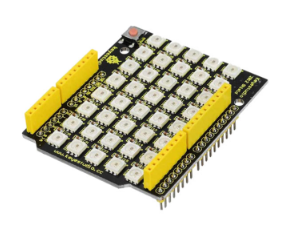
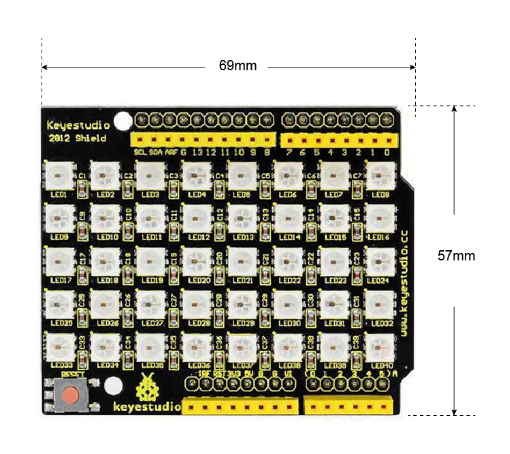
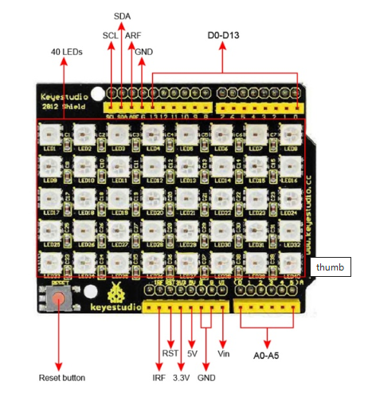
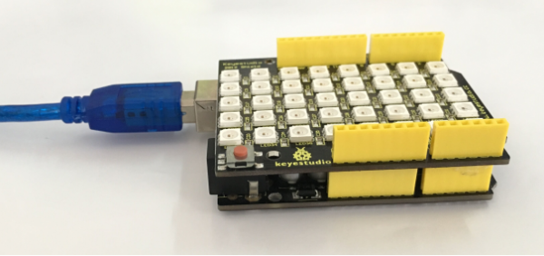
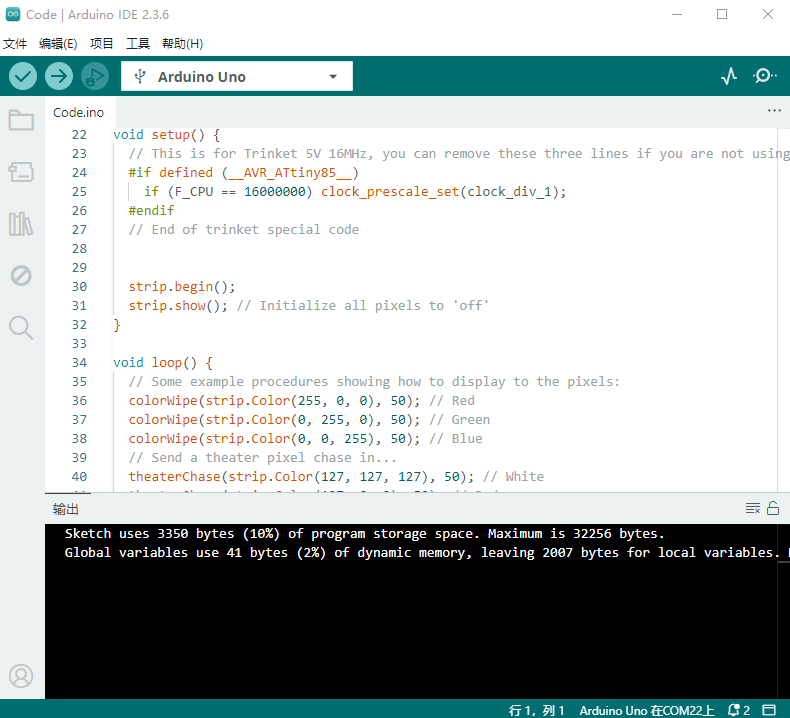
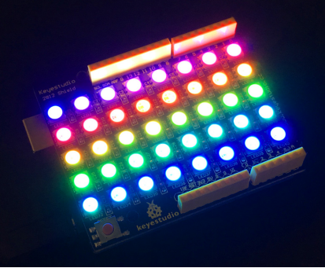
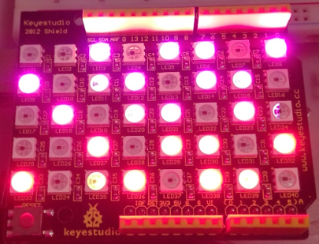

# KS0163 keyestudio 40 RGB LED 2812 Pixel Matrix Shield



## 1. Introduction

keyestudio 2812 shield adopts stackable design, compatible with UNO board. 

It is an intelligent controlled LED light source that the control circuit and RGB chip are integrated in a 5050 SMD component. 

It includes intelligent digital port data latch and signal reshaping amplification drive circuit. Also includes a precision internal oscillator and a 12V programmable constant current control part, effectively ensuring the highly consistency of the pixel point light color.

The data transfer protocol uses single NZR communication mode. After the pixel power-on reset, the DI port receives data from controller, the first pixel collect initial 24bit data then sent to the internal data latch.

LED has the advantages of low driving voltage, environmental-friendly, energy saving, high brightness, large scattering angle, good consistency, long life span, etc.

## 2. Specification of Single LED

- Anti-reverse protection circuit; the reverse power connection will not damage the internal IC of the LED.
- IC control circuit and LED point light source use the same power supply.
- Control circuit and the RGB chip are integrated into a 5050 SMD component, forming a complete control of pixel point.
- Built-in signal reshaping circuit; signals received will be wave-reshaped first and then output to the next driver, ensuring wave-form distortion not accumulate.
- Built-in power-on reset circuit and power-down reset circuit.
- Each pixel of the three primary color can achieve 256 brightness display; complete full color display of 16777216 colors; scan frequency no less than 400Hz/s.
- Serial cascade interface, to complete the reception and decoding of data via a signal line.
- When transmission distance between two arbitrary points is no more than five meters, no extra circuit needed.
- When the refresh rate is 30fps, cascade number no less than 1024 points.
- Data sending speed can reach 800Kbps.
- The color of the light is highly consistent, cost-effective.

## 3. Advantages

- LED with built-in IC is brighter than common LED
- High consistency of RGB chip inside all LEDs
- Built-in driver IC with reliable performance.
- Use hard plastic packaging, preventing press damage.

## 4. Details

- **Dimensions:** 69mm x 57mm x 18mm
- **Weight:** 21.1g



## 5. PINOUTS



## 6. Simple Hookup

Simply stack the shield on UNO BOARD ,then connect them to your computer using a USB cable.



## 7. Sample Code

**Library files and code download：**[Resources](./Resources.7z)

```
#include <Adafruit_NeoPixel.h>
#ifdef __AVR__
#include <avr/power.h>
#endif

#define PIN 13

// Parameter 1 = number of pixels in strip
// Parameter 2 = Arduino pin number (most are valid)
// Parameter 3 = pixel type flags, add together as needed:
//   NEO_KHZ800  800 KHz bitstream (most NeoPixel products w/WS2812 LEDs)
//   NEO_KHZ400  400 KHz (classic 'v1' (not v2) FLORA pixels, WS2811 drivers)
//   NEO_GRB     Pixels are wired for GRB bitstream (most NeoPixel products)
//   NEO_RGB     Pixels are wired for RGB bitstream (v1 FLORA pixels, not v2)
Adafruit_NeoPixel strip = Adafruit_NeoPixel(40, PIN, NEO_GRB + NEO_KHZ800);

// IMPORTANT: To reduce NeoPixel burnout risk, add 1000 uF capacitor across
// pixel power leads, add 300 - 500 Ohm resistor on first pixel's data input
// and minimize distance between Arduino and first pixel.  Avoid connecting
// on a live circuit...if you must, connect GND first.

void setup() {
  // This is for Trinket 5V 16MHz, you can remove these three lines if you are not using a Trinket
  #if defined (__AVR_ATtiny85__)
    if (F_CPU == 16000000) clock_prescale_set(clock_div_1);
  #endif
  // End of trinket special code


  strip.begin();
  strip.show(); // Initialize all pixels to 'off'
}

void loop() {
  // Some example procedures showing how to display to the pixels:
  colorWipe(strip.Color(255, 0, 0), 50); // Red
  colorWipe(strip.Color(0, 255, 0), 50); // Green
  colorWipe(strip.Color(0, 0, 255), 50); // Blue
  // Send a theater pixel chase in...
  theaterChase(strip.Color(127, 127, 127), 50); // White
  theaterChase(strip.Color(127, 0, 0), 50); // Red
  theaterChase(strip.Color(0, 0, 127), 50); // Blue

  rainbow(20);
  rainbowCycle(20);
  theaterChaseRainbow(50);
}

// Fill the dots one after the other with a color
void colorWipe(uint32_t c, uint8_t wait) {
  for(uint16_t i=0; i<strip.numPixels(); i++) {
    strip.setPixelColor(i, c);
    strip.show();
    delay(wait);
  }
}

void rainbow(uint8_t wait) {
  uint16_t i, j;

  for(j=0; j<256; j++) {
    for(i=0; i<strip.numPixels(); i++) {
      strip.setPixelColor(i, Wheel((i+j) & 255));
    }
    strip.show();
    delay(wait);
  }
}

// Slightly different, this makes the rainbow equally distributed throughout
void rainbowCycle(uint8_t wait) {
  uint16_t i, j;

  for(j=0; j<256*5; j++) { // 5 cycles of all colors on wheel
    for(i=0; i< strip.numPixels(); i++) {
      strip.setPixelColor(i, Wheel(((i * 256 / strip.numPixels()) + j) & 255));
    }
    strip.show();
    delay(wait);
  }
}

//Theatre-style crawling lights.
void theaterChase(uint32_t c, uint8_t wait) {
  for (int j=0; j<10; j++) {  //do 10 cycles of chasing
    for (int q=0; q < 3; q++) {
      for (int i=0; i < strip.numPixels(); i=i+3) {
        strip.setPixelColor(i+q, c);    //turn every third pixel on
      }
      strip.show();

      delay(wait);

      for (int i=0; i < strip.numPixels(); i=i+3) {
        strip.setPixelColor(i+q, 0);        //turn every third pixel off
      }
    }
  }
}

//Theatre-style crawling lights with rainbow effect
void theaterChaseRainbow(uint8_t wait) {
  for (int j=0; j < 256; j++) {     // cycle all 256 colors in the wheel
    for (int q=0; q < 3; q++) {
      for (int i=0; i < strip.numPixels(); i=i+3) {
        strip.setPixelColor(i+q, Wheel( (i+j) % 255));    //turn every third pixel on
      }
      strip.show();

      delay(wait);

      for (int i=0; i < strip.numPixels(); i=i+3) {
        strip.setPixelColor(i+q, 0);        //turn every third pixel off
      }
    }
  }
}

// Input a value 0 to 255 to get a color value.
// The colours are a transition r - g - b - back to r.
uint32_t Wheel(byte WheelPos) {
  WheelPos = 255 - WheelPos;
  if(WheelPos < 85) {
    return strip.Color(255 - WheelPos * 3, 0, WheelPos * 3);
  }
  if(WheelPos < 170) {
    WheelPos -= 85;
    return strip.Color(0, WheelPos * 3, 255 - WheelPos * 3);
  }
  WheelPos -= 170;
  return strip.Color(WheelPos * 3, 255 - WheelPos * 3, 0);
}
```



## 8. Test Result

Done uploading the code above to the board, you should see the LED matrix blink with shiny colors.



